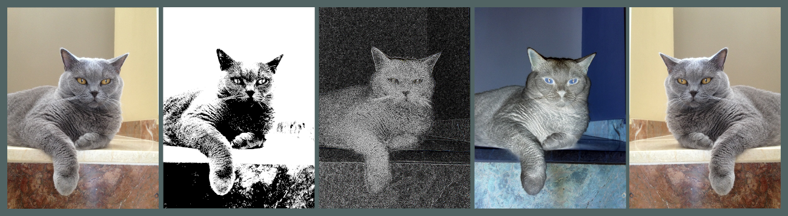

# Image-processing-engine 

C++ image processing engine

  

> [!TIP]
> **Live Demo:** Explore the engine in your browser clicking [here](https://snmanja.github.io/Image-processing-engine/)

## Capabilities

- **Multiformat:** Support for PPM, JPEG, and PNG files
- **Full Linear Pipeline**: Processes images using a Linear Space [0,1] float representation. This ensures physically-accurate filter mathematics and maximum precision between stages, preventing the common "darkening" or color shifting issues of standard 8-bit pipelines.
- **Convolutional filters**: Gaussian blur, Sharpen, Emboss, Laplacian of Gaussian (LoG)
- **Point filters**: Black and white, Sepia, Thresholding, Alpha blending, Linear Adjustment
- **Geometric filters**: Mirror
- **Gradients**: Sobel operator
- Basic CLI implementation with `--help` flag to use as documentation
- Supports "Same" padding strategy to maintain spatial correspondence, with configurable stride.
- Custom border strategy for convolutional filters (Clamping, Wrap, Mirror, Constant)
- **Histogram support**: greyscale, channel (r,g,b), intensity, value and chroma. With **Graph plotting**.
- **Filter chaining** with **JSON-based** pipeline specifications. This enables complex filter chaining with custom parameters and readable configuration. Plus being able to save configurations as templates.
- **Batch processing**: Process all the files in a folder at the same time
- **WebAssembly Integration**: C++ engine compiled via Emscripten for high-performance, client-side image processing without server-side dependencies
- **Interactive Web Interface (WIP)**: A user-friendly interface built with JavaScript and Tailwind CSS to facilitate real-time filter tuning and pipeline experimentation.

## WEB - To do

- Improve Status flag
- Display graphs in some way
- Clean spanglish (some comments and console logs are in spanish)
- Add maximum upload capacity (memory size pre-defined so user do not exceed browsers limits)

## Engine - To do

- Update documentation
- Add 16 bit color compatibility for PNG
- Fix statistics so it takes [0,1] float range
- Concurrent pipeline processing for different files
- Improve github actions testing and CI
- Check common sobel parameters and implement them
- Split rank 1 kernels so convolutions are O(2k) per pixel rather than O(k^2)
- Improve histogram (provide some kind of guide on values). And document them better
- Add dilation parameter to convolution.
- Add common postprocessing parameters (white balance, gain, gamma, normalization, clamping, etc)
- Add custom parameters to already implemented filters
- Median filter
- Add HDR compatibility
- Output info, like histograms calculated, filters applied, settings used would be cool to implement.
- Check easy performance improvements
- Implement "Valid" padding strategy
- Evaluate if even kernels have any utility, and make them usable check how to handle them well.
- Make a template driven applyConvolution so it generates different versions of the function in compile time. The main goal of this would be performance optimization (Less function calls with inlining).
- Simple pipeline support via cli using stdin stdout, supporting pipes in posix systems

## Potential goals for the future

- Applying this engine to computer vision
- Performance optimizations

## How to run

1. Clone the repo.
2. Compile with `make` command on your terminal
3. Add your images (png, jpeg, ppm) on `./pics` and edit `./pipeline.json` for configuration
4. Use `./imgengine` to process your images in batch
5. Obtain the resulting images from `./output`

# Documentation

- `--help` for capabilities, commands and JSON format
- `--list` for list of filters, parameters and descriptions
- `--histograms` for list of histograms supported

# Dependencies

The whole point of this project is to make an usable consumer grade image editing pipeline, with artistic and technical uses with a solid API to ensure deep control for the user. I used libraries for parsing JSON and decoding image files for the backend. At the time being even the graphics of histograms is made by me. I am **NOT** using OpenCV or any other filter library, every stage of the pipeline is implemented from scratch.

So i will be explicit in which libraries i use, just to make it clear what is made by me and whats not:

- JZip: For compression of batch download (web frontend)
- CodeMirror 6: Better IDE for json pipeline (web frontend)
- nlohmann json: Modern JSON parsing (backend).
- stb_image and stb_image_write: PNG and JPEG decoding and encoding (backend).
